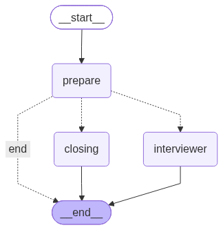

# Interview Engine

Create and activate the repository virtual environment, then install its dependencies:

```bash
python3 -m venv .venv
source .venv/bin/activate
python -m pip install -r backend/requirements-dev.txt
```

Run the development CLI:

```bash
python -m backend.cli.engine-usage --job "Backend engineer role"
```

Prepare the database, then run the FastAPI application:

```bash
python -m backend.cli.migrate backend/interview_studio.sqlite3
python -m backend.cli.load_fixtures backend/interview_studio.sqlite3
python -m uvicorn backend.app.main:app --reload
```

Then open `http://127.0.0.1:8000`. The inline browser harness uses the
`/api/v1/interviews/browser-harness/ws` WebSocket. The application starts and
serves health/capability information without credentials; interview events return a
structured configuration error until `api_key` exists in the `settings` table.

The SQLite database defaults to `backend/interview_studio.sqlite3`. Migrations and
fixtures are independent installation commands; the web application assumes the
schema and required initial records already exist. Runtime application code never
reads `.env`; persisted settings are resolved when each interview session is opened.

The migration history is currently development-only and intentionally consolidated.
Databases created from an earlier migration layout must be recreated before applying
the current migrations; no compatibility upgrade is maintained yet.

Fixtures are plain Python scripts in `backend/fixtures/` and run in the explicit
order listed by `backend/cli/load_fixtures.py`:

1. Insert missing non-secret setting defaults such as `chat_model` and `theme`.
2. Create the singleton `default` developer profile.
3. Create the `browser-harness` development interview attempt.

Each fixture executes idempotent SQL directly. `INSERT OR IGNORE` prevents repeated
execution from overwriting user values or creating duplicate entities. API keys and
other secret settings are never seeded. Repositories treat fixture records as
installation invariants rather than creating them during reads or updates.

After the database schema exists, run fixtures independently:

```bash
python -m backend.cli.load_fixtures backend/interview_studio.sqlite3
```

Run the migration command before the fixture loader and whenever the application
version introduces a new migration.

Health and capability routes:

- `GET /health/live`
- `GET /health/ready`
- `GET /api/v1/capabilities`
- `GET /api/v1/interviews/{attempt_id}/history`
- `DELETE /api/v1/attempts/{attempt_id}`

Settings routes:

- `GET/PATCH /api/v1/settings`
- `DELETE /api/v1/settings/{key}`
- `POST /api/v1/settings/test-provider`

Profile routes:

- `GET/PATCH /api/v1/profile`
- `GET/POST/DELETE /api/v1/profile/avatar`
- `POST /api/v1/profile/cv/import`

Process routes:

- `GET/POST /api/v1/processes`
- `POST /api/v1/processes/import-preview`
- `GET/PATCH/DELETE /api/v1/processes/{process_id}`
- `POST /api/v1/processes/{process_id}/stages/{stage_id}/attempts`

Report routes:

- `GET/POST /api/v1/attempts/{attempt_id}/report`
- `GET /api/v1/processes/{process_id}/report`

Only completed attempts can be evaluated. Evaluation is request-bound and
checkpointer-free: cancelling the request stores no partial report, and a later
request can retry. Valid reports are stored atomically with their schema and
evaluation versions and canonical transcript evidence IDs. Simultaneous
evaluation requests for one attempt return `409`.

Process feedback is computed from persisted attempt reports. It selects the
highest score in each enabled stage, averages those selected stage reports
equally, and reports unevaluated stages as missing coverage rather than zero.

URL imports accept public HTTP(S) HTML or plain-text sources only, enforce bounded
redirects and response sizes, reject local/private destinations, and return
normalized text for preview.

Avatar uploads accept validated JPEG, PNG, or WebP images up to 2 MB. CV import
accepts text-based PDF files up to 10 MB and returns structured AI suggestions.
The uploaded file, extracted text, and suggestions are not persisted by the backend.

Clients should request interview history before starting a WebSocket session. If
history is empty, send `session.start` to generate the greeting. If history is
present, render it and send future `user.text` events directly; this avoids
generating a duplicate question during checkpoint resume.
History responses include the current attempt status. Completed attempts are
read-only in the frontend, while ready, active, and paused attempts can be opened
from their parent process. Deleting an attempt cascades its transcript, graph
state, and pending writes, then recalculates its stage status.

The interview WebSocket also accepts `user.audio.start`, bounded base64
`user.audio.chunk`, `user.audio.end`, `audio.output.cancel`, `mode.update`,
`session.pause`, and `session.resume`. Push-to-talk is the reliable input baseline.
Final transcriptions enter the same canonical text flow as typed answers; receive
progress and partial transcript events are transient. Assistant text is buffered
by sentence before OpenAI speech generation and MP3 output is sent in identified,
sequenced chunks so clients can queue or cancel playback safely.
The spoken-reply preference is stored on the attempt and survives reloads. Speech
input is a direct push-to-talk action gated by the global STT setting, API key,
and transcription model; it is not an attempt preference. Browser microphone
permission and autoplay failures remain transient runtime conditions.

The CLI alone may read `OPENAI_API_KEY` for development convenience. The backend module does not read
environment variables; callers inject credentials, models, and checkpointers through
`InterviewEngineBuilder`.

Run the backend verification suite:

```bash
python -m ruff check backend
python -m ruff format --check backend
python -m mypy
python -m pytest
```

## Interview graph



Regenerate the diagram from the compiled LangGraph definition:

```bash
python -m backend.cli.generate_graph
```

## Interview prompt basis

The versioned prompt follows structured, job-related interviewing guidance:

- [U.S. Office of Personnel Management structured interviews](https://www.opm.gov/policy-data-oversight/assessment-and-selection/structured-interviews)
- [OPM structured interview guide](https://www.opm.gov/policy-data-oversight/assessment-and-selection/structured-interviews/guide/)
- [EEOC guidance on questions employers should avoid](https://www.eeoc.gov/employers/small-business/what-shouldnt-i-ask-when-hiring)
