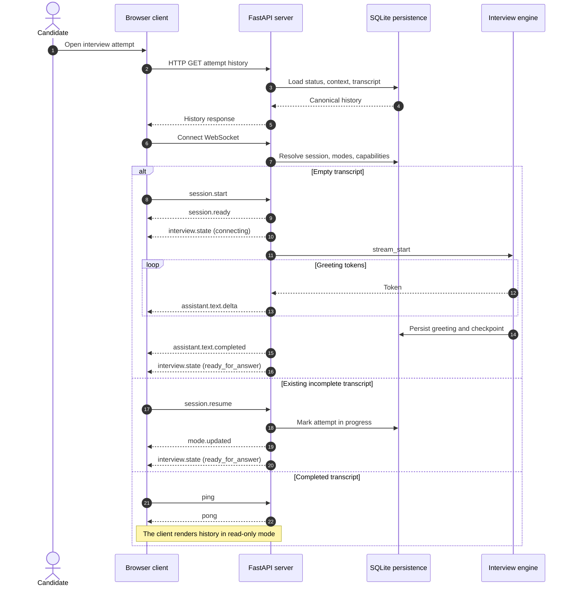
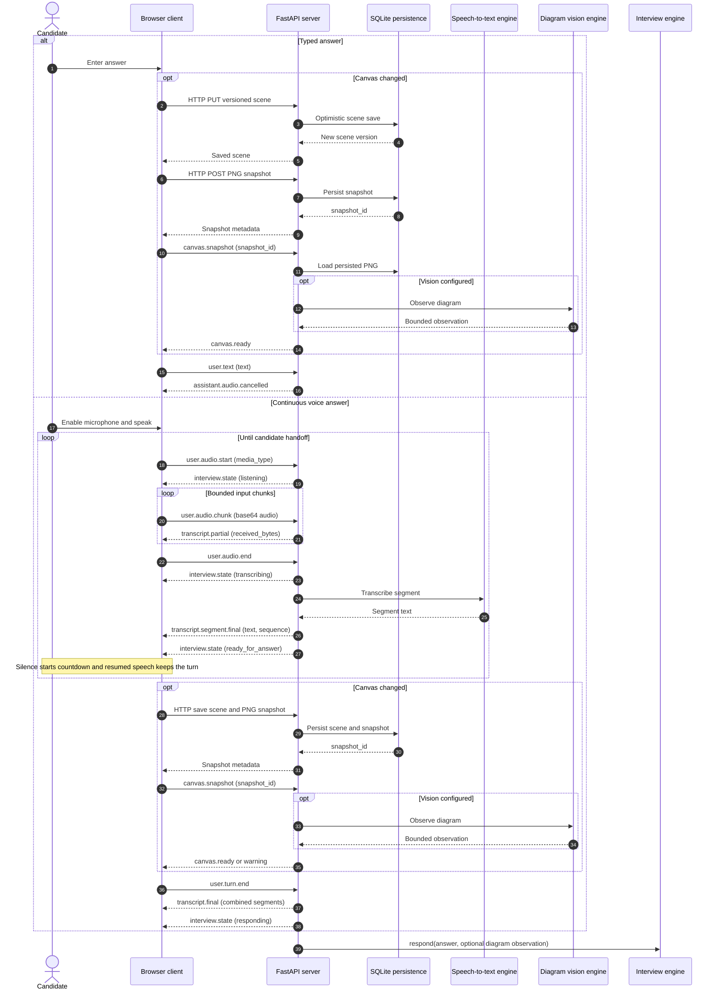
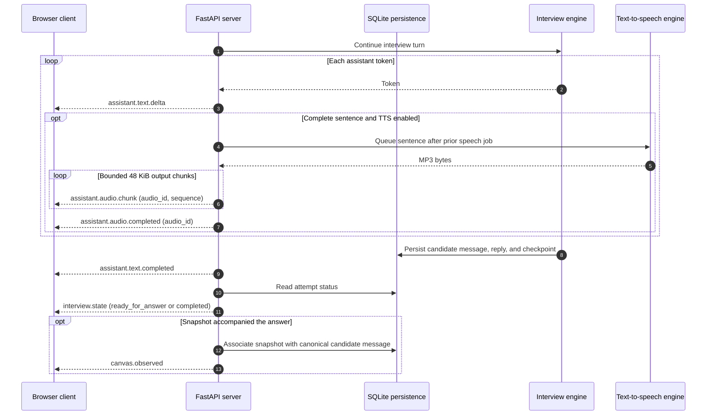
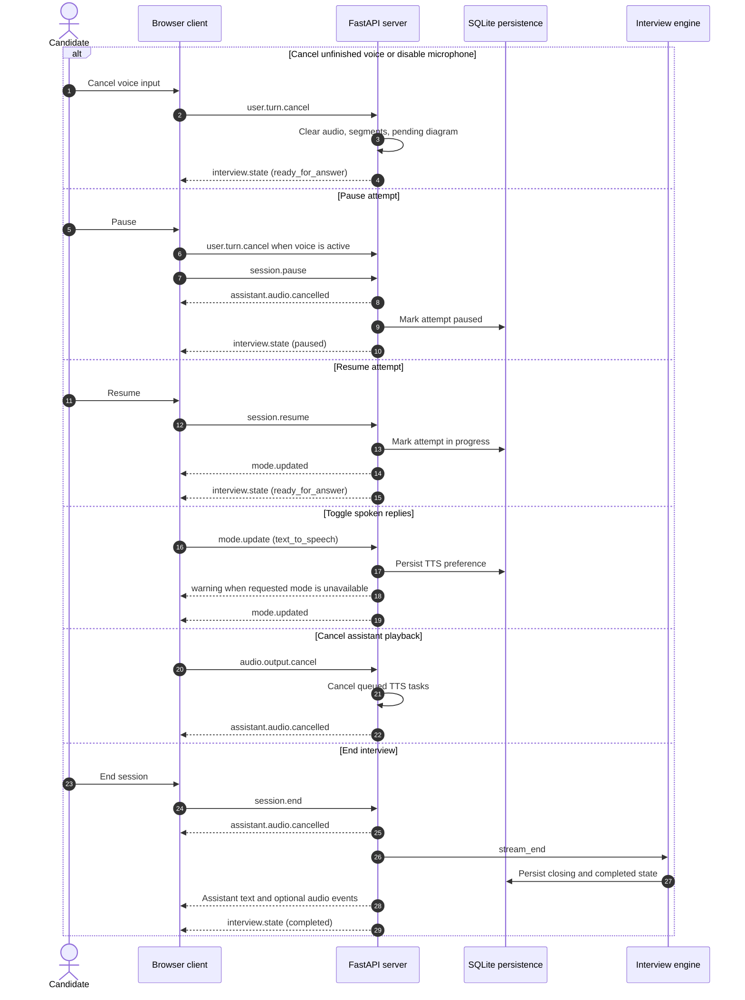

# Interview WebSocket Protocol

Interview Studio uses protocol version `1.2` at:

```text
/api/v1/interviews/{attempt_id}/ws
```

Clients send JSON objects containing `type` and `payload`. Every server event has
this envelope:

```json
{
  "protocol_version": "1.2",
  "event_id": "uuid",
  "attempt_id": "uuid",
  "timestamp": "ISO-8601 timestamp",
  "type": "event.name",
  "payload": {}
}
```

Audio and unfinished speech segments are transient. Completed candidate and
interviewer messages are persisted as the canonical transcript. Whiteboard PNG
bytes use HTTP endpoints; the WebSocket carries only persisted snapshot IDs.

## 1. Connection and session lifecycle

The client loads history before connecting. A new attempt generates its greeting
with `session.start`; an incomplete attempt uses `session.resume` without creating
a duplicate question. Completed attempts remain read-only.



## 2. Candidate input and diagram context

Typed input is one complete candidate turn. Voice input contains one or more
bounded recording segments; STT results accumulate transiently until
`user.turn.end` creates one canonical candidate message. Local VAD closes a
segment after silence and starts the handoff countdown. Resumed speech retains
the candidate's turn.

For a changed system-design canvas, the client first saves the scene and PNG via
HTTP. It then sends `canvas.snapshot` before the text or voice handoff. Vision is
optional; failure produces a warning and the interview continues from transcript
context.



Input limits enforced by the server:

- Each `user.audio.chunk`: 1 byte to 256 KiB after base64 decoding.
- Each recording segment: at most 10 MiB.
- Browser segment rotation: approximately 45 seconds or 3 seconds of silence.
- Candidate handoff: 5-second countdown after a silence-ended segment.

## 3. Assistant streaming and spoken replies

The interview engine streams text tokens. The server buffers complete sentences
for TTS while text is still arriving, serializes speech jobs, and emits identified
MP3 chunks in playback order. The final interaction state is sent after queued
speech finishes. Snapshot association occurs after the graph has persisted the
canonical candidate message.



TTS generation failure emits `warning` and does not interrupt the text flow.
The browser groups chunks by `audio_id`; `sequence` preserves global output order.

## 4. Controls, cancellation, and termination

Pause and microphone disable cancel unfinished candidate speech. Pause additionally
clears queued assistant audio and persists the paused attempt status. Voice input
must be explicitly enabled again after resume.



Invalid client events return `error` with code `invalid_event` or
`unsupported_event`. Application failures retain their structured error code,
message, and field errors. Recoverable media, vision, or association failures use
`warning` so the text interview can continue.

## Event reference

Client events:

- `session.start`, `session.pause`, `session.resume`, `session.end`
- `user.text`
- `user.audio.start`, `user.audio.chunk`, `user.audio.end`
- `user.turn.end`, `user.turn.cancel`
- `canvas.snapshot`
- `mode.update`, `audio.output.cancel`
- `ping`

Server events:

- `session.ready`, `mode.updated`, `interview.state`
- `assistant.text.delta`, `assistant.text.completed`
- `assistant.audio.chunk`, `assistant.audio.completed`, `assistant.audio.cancelled`
- `transcript.partial`, `transcript.segment.final`, `transcript.final`
- `canvas.ready`, `canvas.observed`
- `warning`, `error`, `pong`
